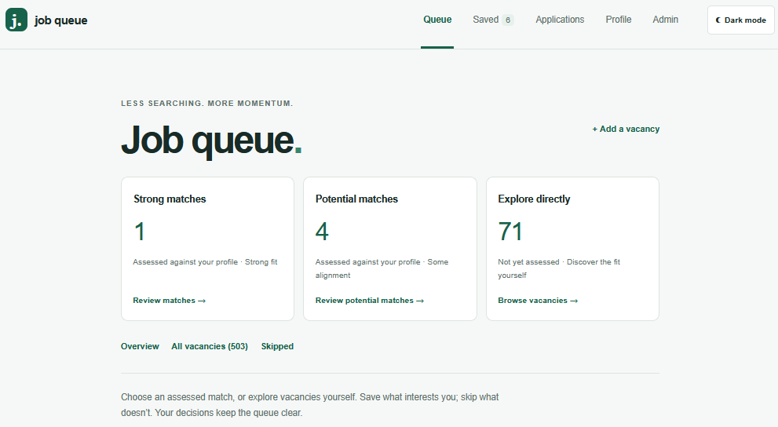
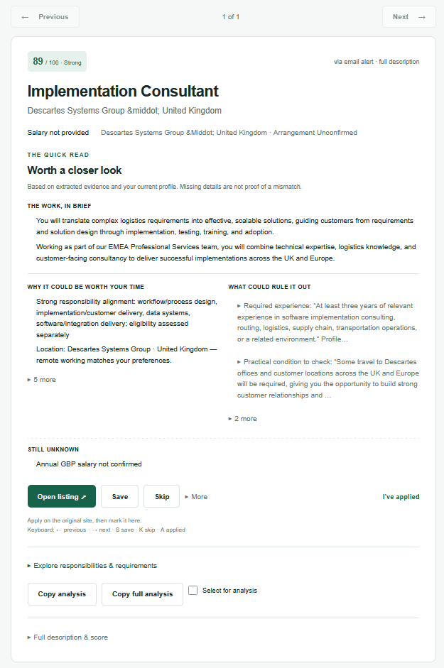

# Job Que

Job Que is a personalised job-discovery and application-tracking system.

It turns fragmented vacancy alerts into structured job records that can be deduplicated, enriched, assessed against an individual profile and reviewed through a prioritised queue.

The system currently supports two users with independent profiles, search strategies and vacancy queues.

## Why I Built It


Job searching is fragmented across alert emails, job boards, saved links and application records.

Searching manually requires constant motivation, context-switching and judgement. In practice, that friction meant I searched inconsistently and risked missing opportunities or losing sight of what the market was asking for.

I built Job Que to reverse that workflow: instead of repeatedly searching for jobs, vacancies come into one system where they can be collected, enriched, deduplicated and assessed against my profile.

It turned job searching from something I had to repeatedly initiate into a pipeline I could review, save from and act on.

## Demo

<table>
  <tr>
    <td width="65%">
      
    </td>
    <td width="35%" valign="top">
      <h3>Personalised job queue</h3>
      <pre>
PROFILE-BASED REVIEW

Strong matches:       1
Potential matches:    4
Explore directly:    71

503 vacancies available

Each vacancy is assessed
against the individual
user's profile.

Save, skip or inspect
before applying.
      </pre>
    </td>
  </tr>

  <tr>
    <td width="65%">
      
    </td>
    <td width="35%" valign="top">
      <h3>Explainable assessment</h3>
      <pre>
IMPLEMENTATION CONSULTANT

89 / 100 · Strong

Quick read:
Worth a closer look

The assessment surfaces:

• Why the role could fit
• What could rule it out
• Information still unknown
• Role responsibilities
• Profile-specific reasoning

Users can open the original
listing, save, skip or record
an application.

Scores support review rather
than replacing user judgement.
      </pre>
    </td>
  </tr>
</table>

## Architecture

```text
Job Alerts          Reed API          Manual URLs
     │                  │                  │
     └──────────────────┼──────────────────┘
                        ↓
               Intake & Normalisation
                        ↓
                  Deduplication
                        ↓
               Supabase / PostgreSQL
                        ↕
             Playwright Enrichment
                        ↓
              Profile-Based Scoring
                        ↓
                 Job Que Interface
                        ↓
             Review → Save → Apply → Track
````

Vacancies are stored independently for each user.

LinkedIn and Indeed listings are enriched through a local Playwright worker before being reassessed against the user's profile.

The enrichment worker currently runs locally. At the present scale this avoids unnecessary hosted infrastructure; the architecture can move to an always-on worker when user volume makes local execution a practical bottleneck.

## Personalisation

Each user has an independent profile containing target roles, skills, experience evidence, location preferences, salary requirements and exclusions.

The current users search across two different domains:

* **Technology & data**
* **Publishing**

The same underlying pipeline generates separate, personalised queues for both.

## Stack

**TypeScript · Next.js · React · Tailwind CSS · PostgreSQL / Supabase · Resend · Playwright · Zod**

## Scale

Verified **21 September 2026**:

**527 stored vacancies · 107 job-alert emails processed · 629 vacancy candidates extracted · 307 duplicates detected · 288 vacancies enriched · 2 independent user profiles**

Sources currently represented include **LinkedIn, Indeed and Reed**.

## Current Status

Job Que is in active private use.

Applications remain human-controlled: Job Que identifies, organises and assesses opportunities, while the user makes the final decision and applies on the original site.

Application code and personal user data remain private.

```
